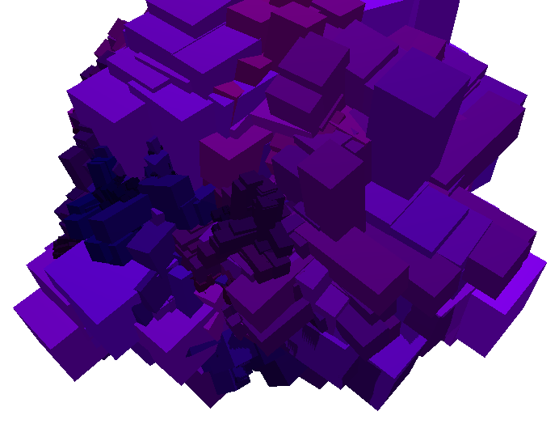
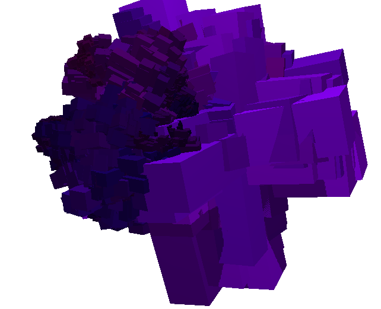

# Fancy Crystals

## Running
 - Clone the repository: `git clone https://github.com/SquidDev/fancy-tal`
 - Install dependencies: `cabal install --only-dependencies`. This may take a while.
 - Run using cabal: `cabal run`.
 - ??
 - Profit!

You can also pass in `--static` to prevent animating the generated crystal (`cabal run -- --static`).

## Controls
 - `wd`, `as` to move rotate the crystal on the x and y planes.
 - `ik` `jl` and `uo` to move the light source on the 3 axes.
 - Arrow keys to move the crystal on the x and y axes
 - `+-` (you may have to use `_` instead of `-`) to zoom in and out.

## Resources used
This uses the following Hackage packages:
 - [GLUT](http://hackage.haskell.org/package/GLUT) for window creation and the event loop.
 - [GLUtil](http://hackage.haskell.org/package/GLUtil) for loading shaders.
 - [OpenGL](http://hackage.haskell.org/package/OpenGL) for rendering
 - [linear](http://hackage.haskell.org/package/linear) for matrix and vector manipulation.
 - [matrix](http://hackage.haskell.org/package/matrix) for matrix manipulation when generating the crystal. I'm planning to switch to linear at some point.
 - [lens](http://hackage.haskell.org/package/lens) to aid in manipulating vectors. Required by linear.
 - [mtl](http://hackage.haskell.org/package/mtl) to aid in generating the crystal.
 - [random](http://hackage.haskell.org/package/random) to source random numbers when generating the crystal.

The following resources were also consulted:

 - A post on [FractalForums](http://www.fractalforums.com/fractals-in-nature/fractal-crystal/msg37127/#msg37127) provided the base for the IFS used to generate crystals.
 - [OpenGL Tutorial](http://www.opengl-tutorial.org/)'s posts on shadow mapping and lighting were used to display the shadows.

## Internals
The crystal is generated through an Iterated Function System which places cubes and randomly rotates by 90 degrees, darkens the colour slightly and shrinks before recursing.

There is also a slight chance for the crystal to "fork" and go in two different directions, adding additional variation to the structure.

This algorithm could undoubtedly be tweaked to produce more aesthetically pleasing crystals such as those of Bismuth.

**Note:** A random state is threaded throughout the IFS. It is theoretically possible to model this number generator as a function and so the system is still deterministic for a given seed.

## Images
A fancy animated image of the crystal rotating.

Cropped regions of random crystals. Note, these were rotated by hand to get a better view.

 
